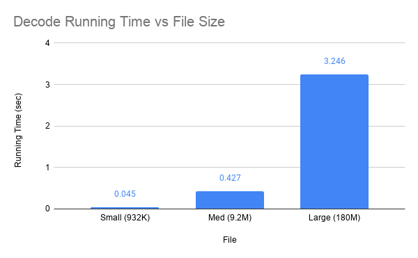

# Basic Dictionary Coder

This is a basic example of a dictionary coder written in C++.  This serves as a basic and rather unoptimized approach.  It works by simultaneously building the dictionary and writing the current 'word' (the col entry) offset in the dictionary.  The use of a hashtable is employed to allow for a fast check to see if the word is already in the dictionary and if so it returns its offset in the dictionary.  Due to this happening simultaneously, the encoded data is stored before the dictionary is written to the output file with a few bytes at the head of the file to give the offset to the start of the dictionary within the encoded file.

## Code Structure
The code for this simple project is consise and stored within a single file, [main.cpp](https://github.com/Mjdgithuber/BasicDictionaryCoder/blob/master/src/main.cpp).  The main functionality is split into three different templated functions encode, decode, and query named after their respective purposes.  Note the use of templates in this code is allow smaller or larger data types to be subbed in to increase the compression ratio.  Currently this feature can only be leveraged by switching the type at compile time, however it would be trivial to have this be adaptive to the input file (but would likely reduce readability).

### Encode
This function works by reading each line of the input file (to be encoded/compressed) and adds it to the dictionary (stored as a vector) if it isn't already contained within the dictionary.  A hashtable is used to store the mapping between an entry and its index in the vector.  At the same time we write the index of each word to the output encoded file, note that some room at the start of the file is reserved for later use to store the position of the dictionary (which is unkown until the file is fully read).  After the input file is read and the output file contains the encoded data, the dictionary is then written to the end of the output file (null terminated).  We then seek to the start of the output file to write the position of said dictionary within the file.

### Decode
This function starts by calling the load_dict function which is responsible for reading the encoded file, seeking to and reading the dictionary.  Once we have the dictionary, we can then proceed to run through the encoded data and converting it to the original word by using the dictionary.  The encoded data is just the binary representation of the dictionary offset.

### Query
This function is very similar to the decode function as it also relies on the load_dict function, however it makes use of the last arg of load_dict to check if a particular string is present within the dictionary.  If such a string is present then its index is returned, otherwise -1 will be returned.  We then proceed to decode the file with the exception that we are no longer generating an output file, instead we just count the number of index matches and print the results.

## Code Usage
Running the program without args will give its usage.
```bash
$ ./prog -c <file_to_compress>           # Compressed file as file_to_compress.enc
$ ./prog -d <file_to_decode>             # Decoded file as file_to_decode.dec
$ ./prog -q <file_to_query> query_term   # Prints # of times query_term shows up in file_to_query
```

### Building
`g++ main.cpp -o prog -std=c++11`

## Results & Analysis
Running time scales approximately linearly with the size of the input.  The following plot shows the running times of the three given data sets for encoding.  Since my program uses a hashtable to store the mapping between a word and its dictionary location, performance is dominated by the number of entires and their average size.  The three input files share the same spread of data with a different set of unique words, so the running time of each set is essentially just a function of the input size however it will run slighly faster the lower the cardinality of the input file is.


The next plot shows the decode operation's running time vs the file it was performed upon.  This is very similar to the last plot because it has the same order notation but doesn't require the addional hash table in order to rebuild the data file as the hash table is only needed to find the offsets in constant time (here the offsets are already known).  



The final plot shows the runtime of the query function.  Again it has a similar shape as the last two plots.  The query run time is dominated the total number of entires in encoded data section, searching for the number of occurences of any word has the same exact runtime as my program must read through the entire encoded file to see how many times a particular offset comes up.  However runtime is vastly improved if the word isn't present because it only needs to check the dictionary and not the actual encoded data (because if it isn't in the dictionary then it can't show up in the encoded section).


All three data sets have a compression ratio of about 2 with my program with encoding using an unsigned 4 byte integer for the dictionary offsets.  It should be noted that the two smaller files can make use of a 2 byte signed integer which about doubles the compression ratio to 4.  The larger files has more than 65536 unique entries and therefore offsets need more than 2 bytes worth of encoded data.  I didn't include a plot because the compression ratio (using my program) is essentially identical due to how these files were generated/distributed.
